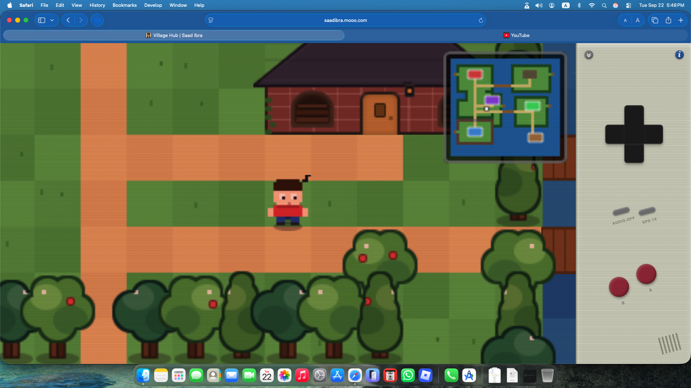

# Heyy, I'm Saad Ibra 🐢🐢🐢

I like software with fewer locks, walls and more freedom
 
 

## Things I've Built

### ↗ [Relatrix](https://github.com/saad-ibra/gray-matter) 🔗

_**Relatrix**_ is a note taking app where you can save files and write _**chronologically organized opinion cards**_ (of different types). Group these cards using _**Tags**_ & draw direct _**Links**_ between related ideas across your library, all visualized in an interactive 3D space called _**Relatrix**_. 

Built for privacy, all data remains _**strictly offline and encrypted**_.

### ▶ [Put myself in a game →](https://saadibra.mooo.com) 🍂

 

## Get In Touch

  
  

